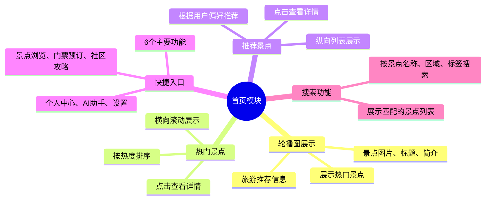
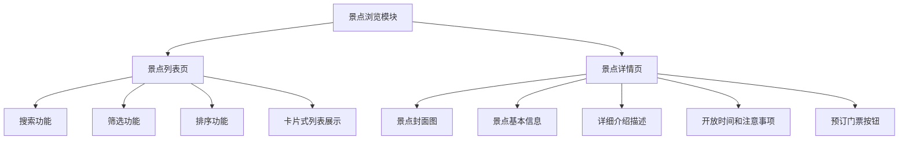
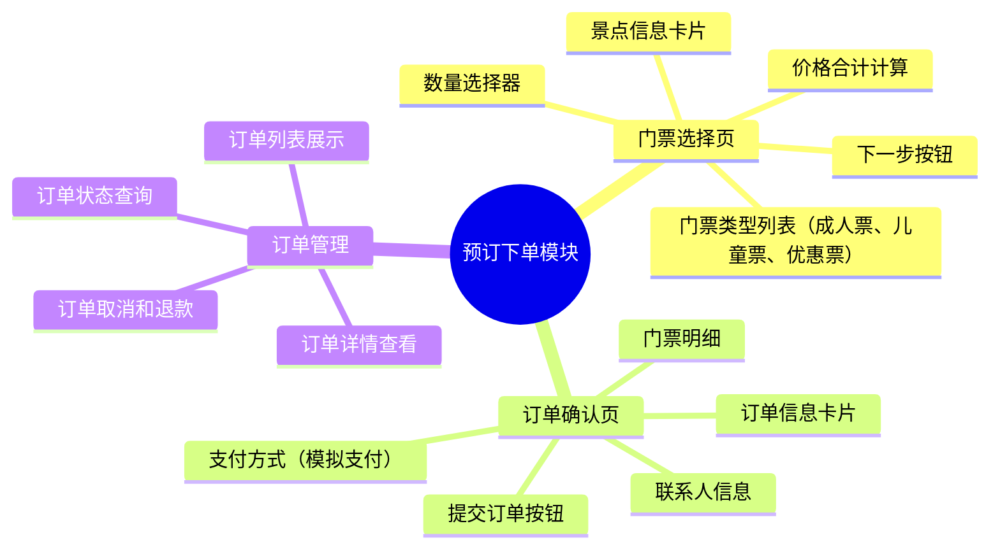
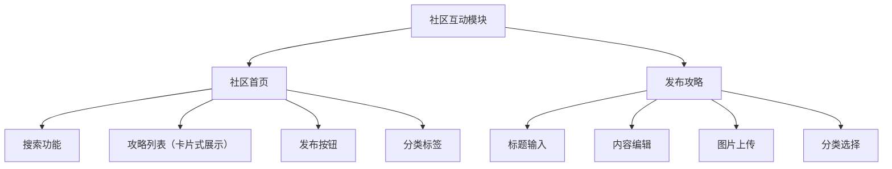
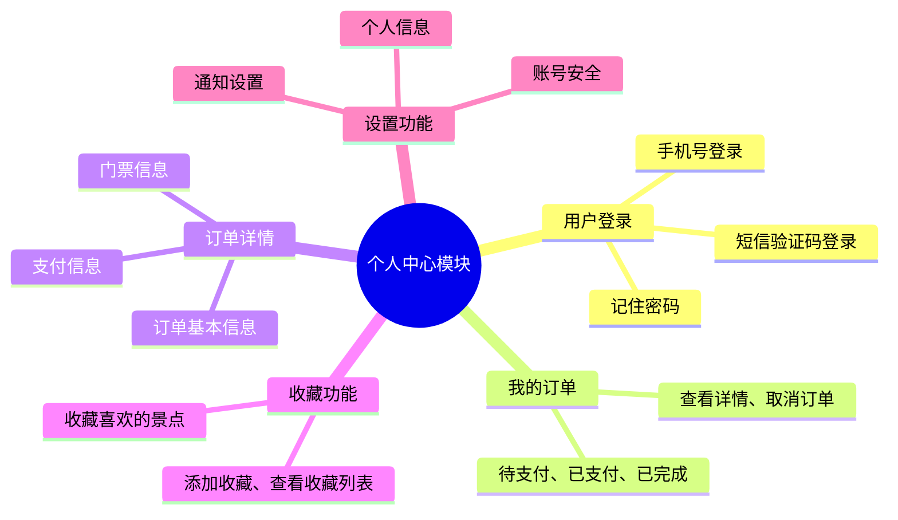
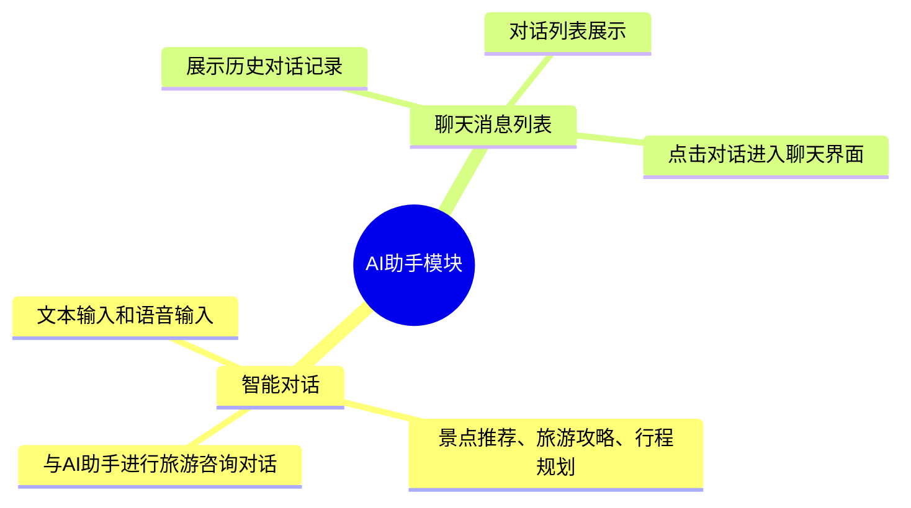
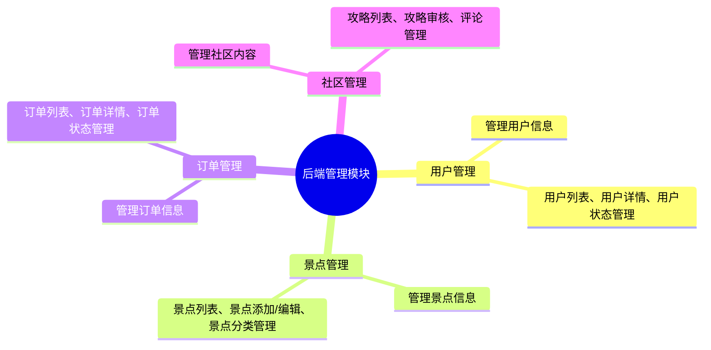

# 功能模块说明

## 1. 首页模块

### 功能概述
首页是用户进入小程序的入口，提供景点浏览、搜索和快捷功能访问的入口。

### 主要功能

#### 1.1 轮播图展示
- **功能描述**：展示热门景点和旅游推荐信息
- **展示内容**：景点图片、标题、简介
- **交互**：点击轮播图可跳转到对应景点详情页

#### 1.2 热门景点
- **功能描述**：展示热门景点列表
- **展示方式**：横向滚动展示
- **排序方式**：按热度排序
- **交互**：点击景点卡片可查看详情

#### 1.3 推荐景点
- **功能描述**：展示推荐景点列表
- **展示方式**：纵向列表展示
- **筛选条件**：根据用户偏好推荐
- **交互**：点击景点卡片可查看详情

#### 1.4 快捷入口
- **功能描述**：提供6个主要功能的快捷入口
- **入口内容**：景点浏览、门票预订、社区攻略、个人中心、AI助手、设置
- **布局**：6个功能图标网格布局

#### 1.5 搜索功能
- **功能描述**：提供景点搜索功能
- **搜索类型**：按景点名称、区域、标签搜索
- **搜索结果**：展示匹配的景点列表

### 页面结构
- 顶部导航栏：包含搜索框和用户信息
- 轮播图区域：展示热门景点
- 热门景点区域：横向滚动展示
- 推荐景点区域：纵向列表展示
- 快捷入口区域：功能图标网格

## 2. 景点浏览模块

### 功能概述
提供景点信息的浏览、搜索和筛选功能。

### 主要功能

#### 2.1 景点列表页
- **功能描述**：展示景点列表
- **搜索功能**：按关键词搜索景点
- **筛选功能**：按区域、分类、价格筛选
- **排序功能**：按价格、评分、距离排序
- **展示方式**：卡片式列表展示

#### 2.2 景点详情页
- **功能描述**：展示景点详细信息
- **展示内容**：
  - 景点封面图
  - 景点基本信息（名称、评分、地址、标签）
  - 详细介绍描述
  - 开放时间和注意事项
- **交互功能**：预订门票按钮

### 页面结构
- 搜索栏：搜索和筛选功能
- 筛选条件：区域、分类、价格等
- 排序选项：价格、评分、距离等
- 景点列表：卡片式展示
- 详情页面：完整信息展示

## 3. 预订下单模块

### 功能概述
提供景点门票的预订和订单管理功能。

### 主要功能

#### 3.1 门票选择页
- **功能描述**：选择门票类型和数量
- **展示内容**：
  - 景点信息卡片
  - 门票类型列表（成人票、儿童票、优惠票）
  - 数量选择器
  - 价格合计计算
- **交互**：下一步按钮

#### 3.2 订单确认页
- **功能描述**：确认订单信息
- **展示内容**：
  - 订单信息卡片
  - 门票明细
  - 联系人信息
  - 支付方式（模拟支付）
- **交互**：提交订单按钮

#### 3.3 订单管理
- **功能描述**：管理用户订单
- **功能内容**：
  - 订单列表展示
  - 订单状态查询
  - 订单详情查看
  - 订单取消和退款

### 页面结构
- 选择页面：门票类型和数量选择
- 确认页面：订单信息确认
- 订单列表：用户订单管理

## 4. 社区互动模块

### 功能概述
提供用户间的旅游攻略分享和互动功能。

### 主要功能

#### 4.1 社区首页
- **功能描述**：展示社区攻略列表
- **展示内容**：
  - 顶部搜索功能
  - 攻略列表（卡片式展示）
  - 发布按钮
  - 分类标签
- **交互**：点击攻略查看详情

#### 4.2 发布攻略
- **功能描述**：用户发布旅游攻略
- **表单内容**：
  - 标题输入
  - 内容编辑
  - 图片上传
  - 分类选择
- **交互**：发布和预览功能

#### 4.3 攻略详情
- **功能描述**：展示攻略详细内容
- **展示内容**：
  - 攻略标题和内容
  - 图片展示
  - 作者信息
  - 评论功能

### 页面结构
- 首页：攻略列表展示
- 发布页面：攻略编辑表单
- 详情页面：攻略内容展示

## 5. 个人中心模块

### 功能概述
提供用户个人信息管理和相关功能入口。

### 主要功能

#### 5.1 用户登录
- **功能描述**：用户手机号登录
- **登录方式**：短信验证码登录
- **记住密码**：可选功能

#### 5.2 我的订单
- **功能描述**：查看和管理订单
- **订单类型**：待支付、已支付、已完成
- **订单操作**：查看详情、取消订单

#### 5.3 订单详情
- **功能描述**：查看具体订单信息
- **展示内容**：订单基本信息、支付信息、门票信息

#### 5.4 收藏功能
- **功能描述**：收藏喜欢的景点
- **收藏管理**：添加收藏、查看收藏列表

#### 5.5 设置功能
- **功能描述**：系统设置
- **设置选项**：个人信息、通知设置、账号安全

### 页面结构
- 登录页面：用户认证
- 订单页面：订单列表和管理
- 设置页面：系统配置

## 6. AI助手模块

### 功能概述
提供智能旅游咨询和对话功能。

### 主要功能

#### 6.1 智能对话
- **功能描述**：与AI助手进行旅游咨询对话
- **对话内容**：景点推荐、旅游攻略、行程规划等
- **交互方式**：文本输入和语音输入

#### 6.2 聊天消息列表
- **功能描述**：展示历史对话记录
- **展示方式**：对话列表展示
- **交互**：点击对话进入聊天界面

### 页面结构
- 聊天列表：历史对话展示
- 对话界面：实时聊天交互

## 7. 后端管理模块

### 功能概述
提供后台管理功能，用于系统数据管理。

### 主要功能

#### 7.1 用户管理
- **功能描述**：管理用户信息
- **管理内容**：用户列表、用户详情、用户状态管理

#### 7.2 景点管理
- **功能描述**：管理景点信息
- **管理内容**：景点列表、景点添加/编辑、景点分类管理

#### 7.3 订单管理
- **功能描述**：管理订单信息
- **管理内容**：订单列表、订单详情、订单状态管理

#### 7.4 社区管理
- **功能描述**：管理社区内容
- **管理内容**：攻略列表、攻略审核、评论管理

### 页面结构
- 用户管理页面：用户列表和操作
- 景点管理页面：景点信息管理
- 订单管理页面：订单信息管理
- 社区管理页面：社区内容管理