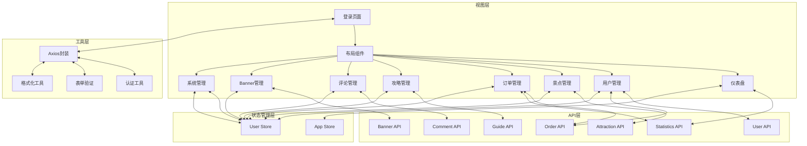

## 产品概述

旅游小程序后台管理系统，基于Vue3 + Element Plus构建，为管理员提供景点、用户、订单、攻略等全业务流程管理界面，支持数据统计分析和系统配置。

## 核心功能

- 登录认证和权限管理
- 数据总览仪表盘，展示核心指标和图表
- 用户管理，包括用户列表、详情、订单查询
- 景点管理，支持景点CRUD、门票类型管理、上下架操作
- 订单管理，支持订单列表、详情查看、状态更新、统计分析
- 攻略管理，包括攻略审核、详情查看、状态管理
- 评论管理，支持评论列表查看和删除
- Banner管理，支持Banner列表、拖拽排序、上下架
- 系统管理，包括系统配置和管理员管理

## 技术栈

- 前端框架：Vue 3 (Composition API) + TypeScript
- 构建工具：Vite
- UI组件库：Element Plus
- 状态管理：Pinia
- 路由管理：Vue Router 4
- HTTP请求：Axios
- 图表库：ECharts
- 日期处理：Day.js
- 拖拽排序：Vue Draggable

## 技术架构

### 系统架构

采用典型的Vue3单页应用架构，包含视图层、状态管理层、API层和工具层：



### 模块划分

- **路由模块**：路由配置和导航守卫

- **API模块**：HTTP请求封装和业务接口定义

- **状态管理模块**：用户状态和应用全局状态

- **公共组件模块**：可复用的UI组件

- **业务页面模块**：各功能模块的页面组件

- **工具模**

  ```mermaid
  graph TB
      %% 样式定义（可选，提升可读性）
      classDef viewLayer fill:#f9f,stroke:#333,stroke-width:1px
      classDef storeLayer fill:#9ff,stroke:#333,stroke-width:1px
      classDef apiLayer fill:#ff9,stroke:#333,stroke-width:1px
      classDef toolLayer fill:#9f9,stroke:#333,stroke-width:1px
  
      %% 视图层（旅游分享后台核心页面）
      subgraph 视图层
          A[登录页面]:::viewLayer -->|验证通过| B[全局布局组件]:::viewLayer
          B --> C[数据仪表盘]:::viewLayer
          B --> D[用户管理]:::viewLayer
          B --> E[景点管理]:::viewLayer
          B --> F[游记/攻略管理]:::viewLayer
          B --> G[评论管理]:::viewLayer
          B --> H[Banner轮播管理]:::viewLayer
          B --> I[审核管理]:::viewLayer
          B --> J[系统管理]:::viewLayer
          
          %% 业务关联（旅游场景核心逻辑）
          F -->|关联景点| E
          G -->|关联游记| F
          I -->|审核游记/评论| F & G
      end
  
      %% 状态管理层（Pinia）
      subgraph 状态管理层
          K[UserStore - 用户/权限]:::storeLayer
          L[AppStore - 全局状态]:::storeLayer
          M[ContentStore - 内容状态]:::storeLayer
      end
  
      %% API层（后端接口封装）
      subgraph API层
          N[UserAPI - 用户CRUD]:::apiLayer
          O[AttractionAPI - 景点CRUD]:::apiLayer
          P[NoteAPI - 游记/攻略CRUD+审核]:::apiLayer
          Q[CommentAPI - 评论CRUD+审核]:::apiLayer
          R[BannerAPI - 轮播图CRUD]:::apiLayer
          S[StatAPI - 数据统计]:::apiLayer
          T[SystemAPI - 系统配置/角色]:::apiLayer
      end
  
      %% 工具层（通用能力）
      subgraph 工具层
          U[Axios封装 - 请求/响应拦截]:::toolLayer
          V[Auth工具 - Token/权限校验]:::toolLayer
          W[Validate工具 - 表单验证]:::toolLayer
          X[Format工具 - 时间/数据格式化]:::toolLayer
          Y[Upload工具 - 图片/视频上传]:::toolLayer
          Z[Error工具 - 全局异常处理]:::toolLayer
      end
  
      %% 核心数据流转链路
      % 1. 登录与权限
      A -->|调用| N
      A -->|依赖| V
      V -->|Token处理| U
      A -->|存储状态| K
      
      % 2. 布局与全局状态
      B -->|读取| L
      J -->|更新| K
      
      % 3. 业务页面与API/Store关联
      C -->|调用| S
      C -->|读取| L
      D -->|调用| N
      D -->|读写| K
      E -->|调用| O
      E -->|依赖| Y
      F -->|调用| P
      F -->|读写| M
      G -->|调用| Q
      G -->|读写| M
      H -->|调用| R
      H -->|依赖| Y
      I -->|调用| P & Q
      J -->|调用| T
      
      % 4. API层统一依赖工具
      N & O & P & Q & R & S & T -->|基于| U
      U -->|集成| V & Z
      
      % 5. 页面通用工具依赖
      D & E & F & H -->|表单校验| W
      C & D & F -->|数据格式化| X
  ```

  **块**：通用工具函数和辅助类

  

### 数据流

用户交互 → 页面组件 → Pinia Store/API → Axios拦截器 → 后端API接口 → 数据返回 → 组件重新渲染

## 实现细节

### 核心目录结构

```
qianduan/
├── src/
│   ├── api/                    # API接口
│   │   ├── request.js         # Axios封装和拦截器
│   │   ├── user.js            # 用户相关API
│   │   ├── attraction.js      # 景点相关API
│   │   ├── order.js           # 订单相关API
│   │   ├── guide.js           # 攻略相关API
│   │   ├── comment.js         # 评论相关API
│   │   ├── banner.js          # Banner相关API
│   │   └── statistics.js      # 统计相关API
│   │
│   ├── assets/                 # 静态资源
│   │   └── styles/            # 全局样式
│   │       ├── variables.scss
│   │       └── common.scss
│   │
│   ├── components/            # 公共组件
│   │   ├── common/            # 通用组件
│   │   │   ├── Table.vue      # 表格组件
│   │   │   ├── Pagination.vue # 分页组件
│   │   │   ├── SearchForm.vue # 搜索表单
│   │   │   ├── ImageUpload.vue # 图片上传
│   │   │   ├── RichTextEditor.vue # 富文本编辑器
│   │   │   └── StatusTag.vue  # 状态标签
│   │   └── charts/            # 图表组件
│   │       ├── LineChart.vue  # 折线图
│   │       ├── BarChart.vue   # 柱状图
│   │       ├── PieChart.vue   # 饼图
│   │       └── StatCard.vue   # 统计卡片
│   │
│   ├── router/               # 路由配置
│   │   └── index.js          # 路由定义
│   │
│   ├── store/                # Pinia状态管理
│   │   ├── modules/
│   │   │   ├── user.js       # 用户模块
│   │   │   └── app.js        # 应用状态
│   │   └── index.js          # Store入口
│   │
│   ├── utils/                # 工具函数
│   │   ├── auth.js           # 权限认证
│   │   ├── permission.js     # 路由权限
│   │   ├── validate.js       # 表单验证
│   │   └── format.js         # 格式化函数
│   │
│   ├── views/                # 页面组件
│   │   ├── login/            # 登录模块
│   │   │   └── index.vue
│   │   ├── layout/           # 布局模块
│   │   │   └── Layout.vue
│   │   ├── dashboard/        # 仪表盘
│   │   │   └── index.vue
│   │   ├── users/            # 用户管理
│   │   │   ├── index.vue
│   │   │   ├── Detail.vue
│   │   │   └── Orders.vue
│   │   ├── attractions/      # 景点管理
│   │   │   ├── index.vue
│   │   │   ├── Form.vue
│   │   │   ├── Detail.vue
│   │   │   └── Tickets.vue
│   │   ├── orders/           # 订单管理
│   │   │   ├── index.vue
│   │   │   ├── Detail.vue
│   │   │   └── Statistics.vue
│   │   ├── guides/           # 攻略管理
│   │   │   ├── index.vue
│   │   │   ├── Detail.vue
│   │   │   └── Audit.vue
│   │   ├── comments/         # 评论管理
│   │   │   └── index.vue
│   │   ├── banners/          # Banner管理
│   │   │   └── index.vue
│   │   └── system/           # 系统管理
│   │       ├── Config.vue
│   │       └── Admins.vue
│   │
│   ├── App.vue               # 根组件
│   └── main.js               # 入口文件
│
├── index.html
├── package.json
└── vite.config.js
```

### 关键代码结构

**Axios封装 (request.js)**

```javascript
import axios from 'axios'
import { ElMessage } from 'element-plus'
import { useUserStore } from '@/store/modules/user'

const request = axios.create({
  baseURL: '/api',
  timeout: 10000
})

// 请求拦截器
request.interceptors.request.use(
  config => {
    const userStore = useUserStore()
    if (userStore.token) {
      config.headers.Authorization = `Bearer ${userStore.token}`
    }
    return config
  },
  error => Promise.reject(error)
)

// 响应拦截器
request.interceptors.response.use(
  response => response.data,
  error => {
    ElMessage.error(error.message)
    return Promise.reject(error)
  }
)

export default request
```

**路由配置 (router/index.js)**

```javascript
import { createRouter, createWebHistory } from 'vue-router'

const routes = [
  {
    path: '/login',
    name: 'Login',
    component: () => import('@/views/login/index.vue'),
    meta: { title: '登录', hidden: true }
  },
  {
    path: '/',
    component: () => import('@/views/layout/Layout.vue'),
    redirect: '/dashboard',
    children: [
      {
        path: 'dashboard',
        name: 'Dashboard',
        component: () => import('@/views/dashboard/index.vue'),
        meta: { title: '数据总览', icon: 'DataAnalysis' }
      },
      // ... 其他路由配置
    ]
  }
]

const router = createRouter({
  history: createWebHistory(),
  routes
})

export default router
```

**User Store (store/modules/user.js)**

```javascript
import { defineStore } from 'pinia'
import { loginApi, logoutApi } from '@/api/user'

export const useUserStore = defineStore('user', {
  state: () => ({
    token: localStorage.getItem('token') || '',
    userInfo: null
  }),
  actions: {
    async login(loginForm) {
      const data = await loginApi(loginForm)
      this.token = data.token
      this.userInfo = data.userInfo
      localStorage.setItem('token', data.token)
    },
    async logout() {
      await logoutApi()
      this.token = ''
      this.userInfo = null
      localStorage.removeItem('token')
    }
  }
})
```

### 技术实现方案

1. **路由配置和导航守卫**

- 使用Vue Router 4配置所有页面路由
- 实现路由守卫进行登录验证
- 动态生成侧边栏菜单

2. **API封装和请求拦截**

- 创建Axios实例统一管理请求
- 实现请求和响应拦截器
- 统一错误处理和loading状态管理

3. **状态管理**

- 使用Pinia进行状态管理
- 用户模块：管理登录状态、用户信息
- 应用模块：管理全局配置、菜单等

4. **公共组件开发**

- 表格组件：封装Element Plus表格，支持选择、排序、分页
- 分页组件：统一的分页交互
- 搜索表单：动态表单项配置
- 图片上传：支持单图/多图、预览
- 富文本编辑器：集成WangEditor
- 状态标签：不同状态显示不同颜色
- 图表组件：封装ECharts，支持折线图、柱状图、饼图

5. **页面开发**

- 登录页面：表单验证、登录认证
- 布局组件：侧边栏、顶部栏、内容区
- 仪表盘：数据卡片、图表展示
- 各业务模块：列表、详情、表单、统计等页面

### 集成点

- 后端API接口：http://localhost:8080
- 路由导航守卫：登录状态验证
- 状态持久化：LocalStorage存储token
- 响应拦截：统一错误提示

## 技术考虑

### 性能优化

- 路由懒加载：所有页面组件使用动态导入
- 组件按需加载：只在需要时加载
- 图片懒加载：列表页面图片延迟加载
- 请求缓存：不经常变化的数据缓存到本地

### 安全措施

- Token认证：JWT token存储在LocalStorage
- 请求拦截：自动携带token
- 路由守卫：未登录重定向到登录页
- 表单验证：所有表单字段进行验证
- XSS防护：对用户输入进行转义

### 可扩展性

- 模块化设计：各功能模块独立
- 组件复用：公共组件可在多个页面使用
- API模块化：按业务模块划分API接口
- 状态模块化：Pinia store按模块划分

## 设计风格

采用Element Plus企业级设计系统，打造专业、高效的后台管理界面。整体风格简洁明快，注重信息层级和操作效率。

## 应用类型

Web端后台管理系统，针对桌面浏览器优化，支持大屏展示和高效操作。

## 设计内容描述

### 页面规划

共设计6个核心页面，覆盖系统主要功能：

#### 1. 登录页面

- **顶部品牌区**：系统名称和Logo，居中显示，渐变背景
- **中央登录表单**：白色卡片悬浮，阴影效果，包含用户名、密码、记住密码
- **底部装饰**：简洁的背景图形，增强视觉层次

#### 2. 主布局页面

- **左侧导航栏**：深色背景，菜单项带图标，当前页面高亮，支持折叠
- **顶部工具栏**：白色背景，面包屑导航、用户头像、下拉菜单（退出登录）
- **主内容区**：浅灰背景，白色卡片式内容展示

#### 3. 数据总览

- **顶部统计卡片行**：4个卡片，展示用户数、订单数、景点数、攻略数，带图标和趋势
- **中间图表区**：左侧用户增长趋势折线图，右侧订单统计柱状图
- **底部数据列表**：左侧最新订单列表，右侧最新攻略列表

#### 4. 列表管理页面（用户、景点、订单、攻略、评论）

- **顶部搜索栏**：表单搜索、时间筛选、状态筛选、搜索按钮、重置按钮
- **操作按钮栏**：新增、批量操作、导出等按钮
- **数据表格**：白色背景，斑马纹，悬停高亮，操作按钮列
- **底部分页**：页码、每页条数选择、总条数

#### 5. 表单页面（景点表单、系统配置）

- **标题栏**：面包屑导航、页面标题
- **表单卡片**：分组展示，基本信息、详细信息、标签设置等
- **底部按钮栏**：保存、取消按钮，固定底部

#### 6. 详情页面

- **头部信息卡片**：基本信息展示，带头像
- **统计数据卡片**：相关数据统计
- **列表/内容区**：关联数据列表或富文本内容展示
- **操作记录**：状态流转记录或评论列表

### 设计原则

- **清晰的信息层级**：使用字体大小、颜色、间距区分信息重要性
- **一致的视觉语言**：统一的颜色、圆角、阴影、间距
- **高效的交互设计**：减少操作步骤，提供快捷操作
- **友好的反馈提示**：操作成功、错误提示及时反馈
- **响应式布局**：适配不同屏幕尺寸

### 交互体验

- **加载状态**：表格、表单提交时显示loading
- **确认提示**：删除、下架等危险操作需二次确认
- **悬停效果**：按钮、表格行悬停有视觉反馈
- **过渡动画**：页面切换、对话框弹出使用平滑过渡