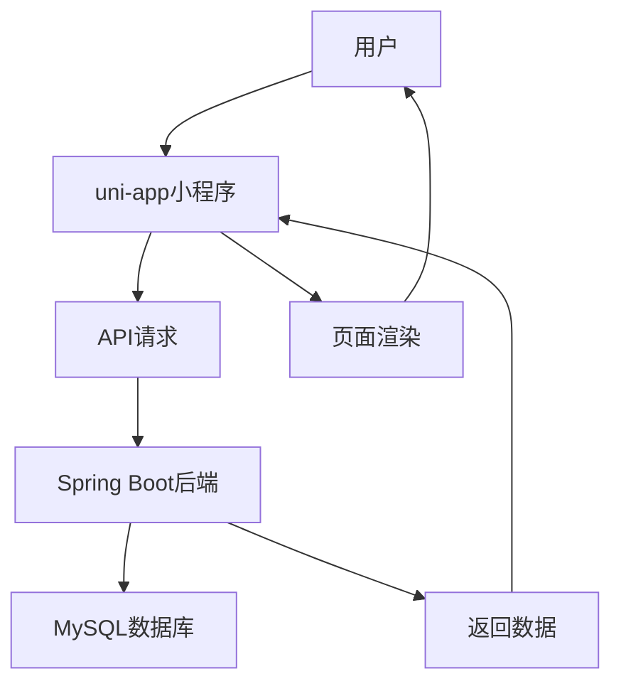

## 产品概述

基于uni-app框架和Spring Boot后端，开发功能完整的旅游小程序。包括后端PublicController创建、小程序前端所有页面开发、API对接、性能优化及前后端数据格式统一。

## 核心功能

- 首页：轮播图、热门景点、推荐景点、快捷入口
- 景点浏览：景点列表、详情页、门票选择
- 预订下单：订单确认、模拟支付、订单管理
- 社区互动：攻略浏览、发布攻略、评论互动
- 个人中心：用户登录、我的订单、收藏、设置
- AI助手：智能对话、旅游咨询

## 技术栈

- 后端：Spring Boot + MySQL + Spring Data JPA
- 前端：uni-app (Vue 3)
- API：RESTful统一响应格式 {code, message, data, timestamp}
- 数据库：travel_system

## 技术架构

### 系统架构

采用前后端分离架构，后端提供RESTful API，前端uni-app负责页面展示和用户交互。



### 模块划分

- **后端API模块**：PublicController提供公开接口（用户认证、景点查询、订单创建、社区互动）
- **前端页面模块**：5个Tab页面 + 14个功能页面
- **工具模块**：HTTP请求封装、状态管理、工具函数
- **公共组件模块**：轮播图、景点卡片、评论组件等

### 数据流

用户操作 → uni-app页面 → 封装的API请求 → Spring Boot Controller → Service → Repository → MySQL → 返回数据 → 前端渲染

## 实施细节

### 核心目录结构

```
后端管理系统/demo/demo/src/main/java/com/example/demo/
├── controller/
│   └── PublicController.java          # 新建：公开API接口
├── service/
│   ├── UserService.java               # 新增：用户登录注册
│   ├── AttractionService.java          # 扩展：景点查询
│   └── OrderService.java              # 扩展：订单创建
└── common/
    └── ApiResponse.java               # 已有：统一响应格式

小程序/ly/
├── pages/
│   ├── home/index.vue                # 首页
│   ├── attractions/
│   │   ├── list.vue                  # 景点列表
│   │   ├── detail.vue                # 景点详情
│   │   ├── ticket.vue                # 门票选择
│   │   └── order.vue                 # 订单确认
│   ├── bookings/index.vue            # 预订入口
│   ├── community/
│   │   ├── index.vue                 # 社区首页
│   │   └── post.vue                  # 发布攻略
│   ├── profile/
│   │   ├── index.vue                 # 个人中心
│   │   ├── login.vue                 # 登录
│   │   ├── orders.vue                # 我的订单
│   │   ├── orderDetail.vue           # 订单详情
│   │   ├── favorites.vue             # 收藏
│   │   └── settings.vue              # 设置
│   └── ai/index.vue                  # AI助手
├── api/
│   ├── index.js                      # API统一封装
│   ├── user.js                       # 用户接口
│   ├── attraction.js                 # 景点接口
│   ├── order.js                      # 订单接口
│   └── community.js                  # 社区接口
├── components/
│   ├── AttractionCard.vue            # 景点卡片组件
│   ├── CommentItem.vue               # 评论组件
│   └── TabBar.vue                    # 底部导航组件
├── utils/
│   ├── request.js                    # HTTP请求封装
│   ├── storage.js                    # 本地存储封装
│   └── auth.js                       # 认证工具
└── store/
    └── index.js                      # 状态管理
```

### 关键代码结构

**PublicController接口**：提供用户登录注册、景点查询、订单创建等公开API
**ApiResponse统一响应**：{code, message, data, timestamp}格式
**前端API封装**：统一的请求拦截、错误处理、响应数据解析

### 技术实施方案

1. **后端PublicController开发**

- 用户登录注册接口（手机号验证）
- 景点列表/详情/搜索接口
- 订单创建/查询接口
- 社区攻略发布/评论接口

2. **前端页面开发**

- 5个Tab页面配置和导航
- 14个功能页面按模板文档实现
- API对接和数据绑定
- 页面间参数传递

3. **性能优化**

- 图片懒加载
- 列表分页加载
- 接口数据缓存
- 页面预加载

4. **数据格式统一**

- 前后端遵循相同的响应格式
- 统一的字段命名规范
- 统一的日期时间格式
- 统一的价格和评分格式

### 集成点

- 后端API地址配置：http://localhost:8082/api
- 请求头：需要携带token的接口添加Authorization
- 错误处理：统一处理code非200的情况
- 跨域配置：Spring Boot配置CORS支持

## 技术考虑

### 日志

- 后端使用SLF4J记录API请求日志
- 前端封装统一的请求日志输出

### 性能优化

- 景点列表分页加载（每页10条）
- 图片使用CDN或压缩
- 关键数据本地缓存（景点列表、用户信息）
- 页面懒加载和预加载结合

### 安全措施

- 用户密码BCrypt加密
- Token机制（简单实现）
- SQL注入防护（JPA参数化查询）
- XSS防护（输入输出过滤）

### 可扩展性

- 模块化设计便于功能扩展
- 接口版本控制预留
- 配置文件分离（开发/生产环境）

## 设计风格

采用现代简约的旅游应用设计风格，以青色(#00bcd4)为主色调，配合白色背景和卡片式布局，营造清新、专业的旅游服务体验。

## 页面规划

### 1. 首页

顶部搜索栏 + 轮播图区域 + 快捷入口(6个图标网格) + 热门景点横向滚动 + 推荐景点纵向列表

### 2. 景点列表页

导航栏(返回+标题) + 搜索框 + 筛选栏(全部/区域/分类/价格) + 排序栏(默认/价格/评分/距离) + 景点卡片列表

### 3. 景点详情页

景点封面图 + 景点信息(名称/评分/地址/标签) + 介绍描述 + 开放时间 + 注意事项 + 底部预订按钮

### 4. 门票选择页

景点信息卡片 + 门票类型列表(成人票/儿童票/优惠票) + 数量选择器 + 价格合计 + 下一步按钮

### 5. 订单确认页

订单信息卡片 + 门票明细 + 联系人信息 + 支付方式(模拟) + 提交订单按钮

### 6. 个人中心页

用户信息卡片 + 订单入口 + 收藏入口 + 设置入口 + 其他功能入口

### 7. 社区页

顶部搜索 + 攻略列表(卡片式) + 发布按钮 + 分类标签

### 8. AI助手页

聊天消息列表 + 输入框 + 发送按钮