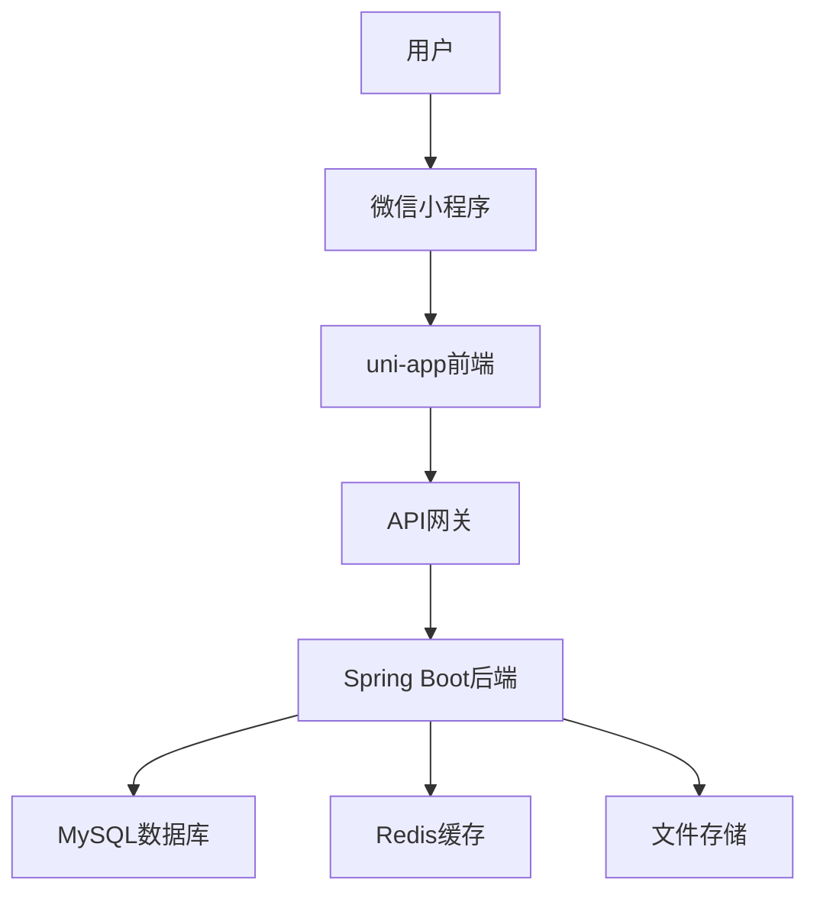

# 旅游小程序项目概述

## 项目简介

旅游小程序是一个基于微信平台的移动旅游服务应用，旨在为用户提供便捷的景点浏览、门票预订、社区互动等旅游相关服务。该项目采用前后端分离架构，前端使用uni-app框架开发，后端使用Spring Boot提供RESTful API服务。

## 技术架构

### 前端技术栈
- **框架**：uni-app (基于Vue 3)
- **UI组件**：uView UI
- **状态管理**：Vuex
- **路由**：uni-app路由系统
- **网络请求**：uni-request
- **图片处理**：uni-app图片组件

### 后端技术栈
- **框架**：Spring Boot 2.7.x
- **数据库**：MySQL 8.0
- **持久层**：MyBatis Plus
- **安全框架**：Spring Security
- **API文档**：Swagger 3.x
- **服务器**：Tomcat

### 数据库设计
- **数据库名称**：travel_system
- **表结构**：包含用户表、景点表、订单表、攻略表等
- **数据量**：预计支持10万级用户和百万级数据

## 系统特点

### 核心功能
1. **景点浏览**：提供丰富的景点信息和搜索功能
2. **门票预订**：支持多种门票类型和在线预订
3. **社区互动**：用户可以发布和浏览旅游攻略
4. **个人中心**：用户管理个人信息和订单
5. **AI助手**：提供智能旅游咨询功能

### 技术特色
- **前后端分离**：实现真正的前后端分离架构
- **响应式设计**：适配各种设备屏幕
- **性能优化**：图片懒加载、列表分页加载
- **数据安全**：用户密码加密、Token认证
- **统一响应格式**：标准化的API响应格式

## 开发环境

### 前端开发环境
- **开发工具**：HBuilderX
- **Node.js版本**：14.x 或更高
- **npm版本**：6.x 或更高

### 后端开发环境
- **开发工具**：IntelliJ IDEA
- **JDK版本**：1.8 或更高
- **Maven版本**：3.6.x 或更高
- **数据库**：MySQL 8.0

## 项目目标

1. 提供便捷的旅游服务，满足用户的景点浏览和预订需求
2. 构建活跃的旅游社区，促进用户间的信息分享
3. 实现智能旅游咨询，提升用户体验
4. 确保系统的稳定性和安全性
5. 支持系统的扩展和后续功能迭代

## 预期成果

- 完整的旅游小程序应用
- 详细的API接口文档
- 完善的系统设计文档
- 可运行的系统源码
- 用户使用手册

## 版本历史

| 版本 | 更新日期 | 更新内容 | 更新人 |
|------|----------|----------|--------|
| v1.0 | 2025-12 | 初始版本 | 开发团队 |

## 联系方式

- **项目负责人**：[姓名]
- **联系方式**：[邮箱/电话]
- **项目地址**：[GitHub/Gitee地址]